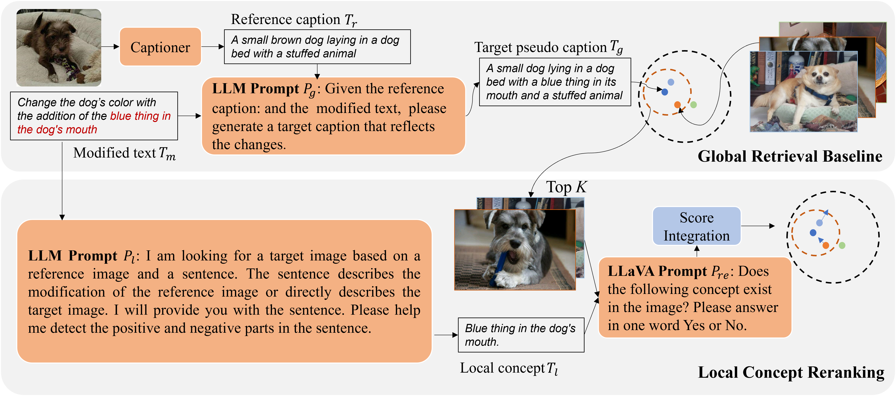

# :fire:  FreeLCR
Code release of paper: [**Training-free Zero-shot Composed Image Retrieval with Local Concept Reranking**](https://arxiv.org/abs/2312.08924)



##### Stage 1: Global Retrieval Baseline
We generate caption for the reference image, as "reference_caption", and "target_caption" with ChatGPT4-turbo. Both the "reference_caption" and "target_caption" are saved in directory: [here](https://github.com/SunTongtongtong/FreeLCR/tree/main/caption)

<!-- ##### Stage 2: Local Concept Reranking -->

 ## TO-DO LIST
- [x] Update datasets 
- [ ] Demo and Codes


## Citation

If you find our work useful in your research, please consider citing:

```
@article{sun2023training,
  title={Training-free zero-shot composed image retrieval with local concept reranking},
  author={Sun, Shitong and Ye, Fanghua and Gong, Shaogang},
  journal={arXiv preprint arXiv:2312.08924},
  year={2023}
}
```